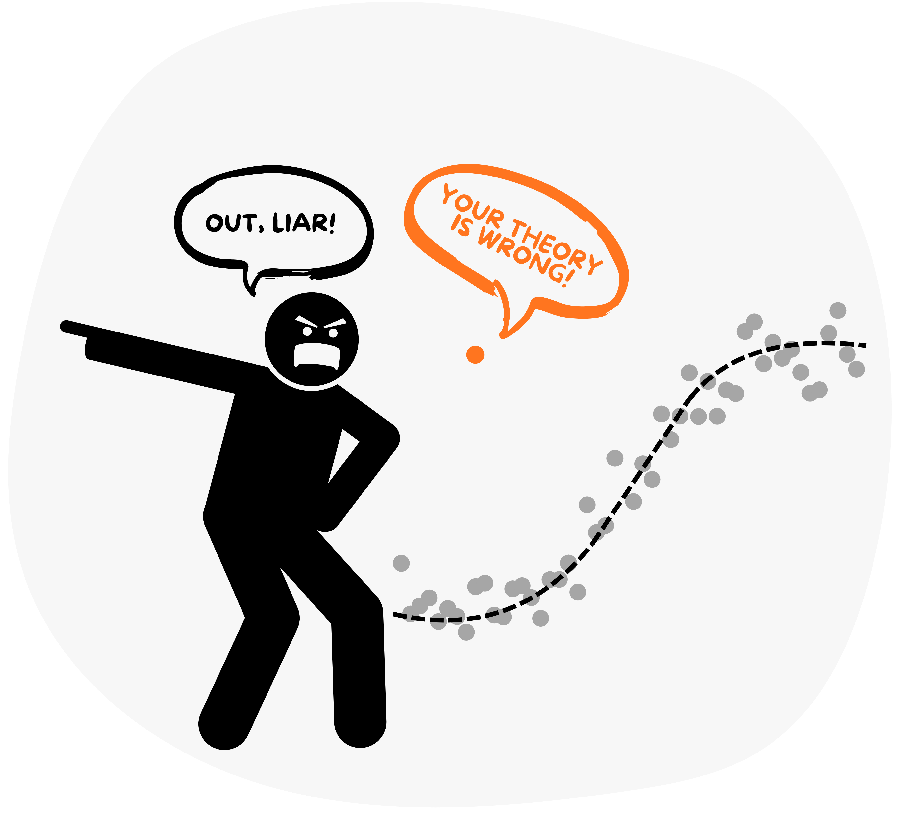

## Exploratory Data Analysis and Statistical Modeling  
**MI4011 Modeling Tools for Environmental Scientific Studies, Block 1**

### About this block

This block introduces you to exploratory data analysis (EDA) and statistical modeling using environmental datasets. You will learn how to examine data structure, visualize patterns, and apply statistical methods to support scientific interpretation and prediction.

The block emphasizes a data-first workflow. You will explore datasets before fitting models and learn how data characteristics, such as distributions, variability, and outliers, influence statistical choices. Examples and exercises are based on real problems from environmental chemistry, water quality, climate-related time series, and ecotoxicology.

All work in this block is carried out in Python using widely adopted scientific libraries. The focus is on clear, reproducible analysis similar to current research practice in environmental science.

---

### Aims of the block

The aim of this block is to equip you with the skills to analyze environmental data critically and responsibly. By the end of the block, you should be able to choose appropriate statistical tools, apply them correctly, and interpret results in a scientifically meaningful way.

Specifically, this block aims to help you:

- Understand the purpose of exploratory data analysis and how it guides modeling decisions  
- Summarize and visualize environmental data in a clear and informative way  
- Use basic statistical methods to investigate relationships and test hypotheses  
- Build and evaluate simple empirical statistical models  
- Develop reproducible and transparent data analysis workflows  

---

### Intended learning outcomes

By completing this block, you should be able to:

1. **Apply exploratory data analysis techniques**  
   - Inspect datasets to identify structure, trends, and anomalies  
   - Recognize limitations and potential sources of bias in data  

2. **Work with different types of environmental data**  
   - Identify numerical and categorical variables  
   - Select appropriate summaries and visualizations based on data type  

3. **Visualize and describe data distributions and relationships**  
   - Interpret plots commonly used in environmental science  
   - Use visualization to inform subsequent analysis steps  

4. **Perform statistical inference**  
   - Formulate null and alternative hypotheses  
   - Choose and apply appropriate statistical tests  
   - Interpret statistical significance in context  

5. **Analyze data using correlation and regression**  
   - Quantify relationships between variables  
   - Fit and interpret simple and multiple linear regression models  
   - Assess model assumptions using diagnostic tools  

6. **Evaluate and compare statistical models**  
   - Use goodness of fit metrics such as $R^{2}$  and RMSE  
   - Identify overfitting and underfitting  
   - Select models that balance simplicity and performance  

7. **Conduct reproducible analysis in Python**  
   - Implement complete analysis workflows in Python  
   - Communicate results clearly using code, figures, and written interpretation  
